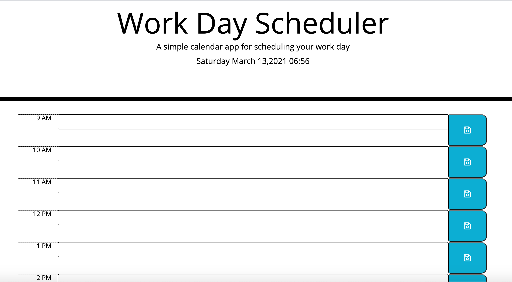

# Day Planner
 

## Introduction
This repository provides the HTML, CSS, and Javascript files for a daily planner. The app provides an opportunity to insert and store events by the hour.

The website incorporates several HTML5, CSS, and Javascript skills including the DOM manipulation

## Installation
To view the repository as well as the actual webpage, please use the following link for access.
https://bk7711.github.io/dayPlanner/ - Day Planner

Below is a preview of the html:

